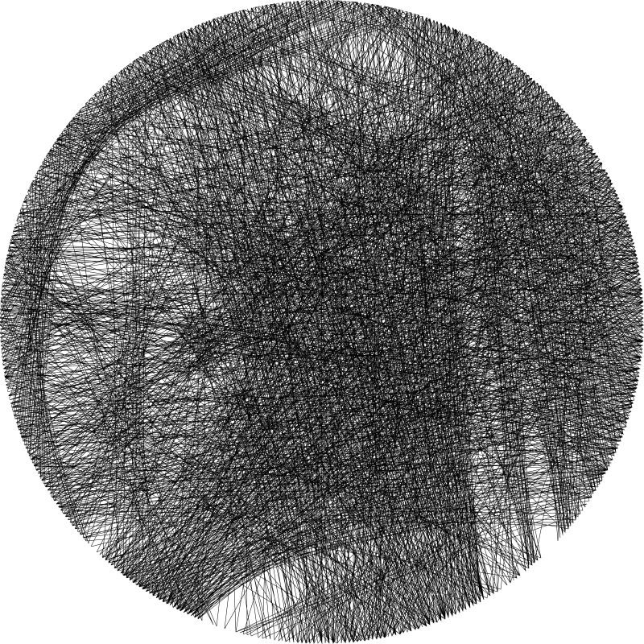

# PyAnchorKnit
Inspired by the work of [Petros Vrellis](https://www.instagram.com/pvrellis/). Based on [Weaver](https://github.com/alyyousuf7/Weaver).

## Installation
Usage of [pipx](https://pypa.github.io/pipx/) is encouraged.

```bash
pipx install pyanchorknit
```

## Example usage
```bash
pyanchorknit imgs/Johannes-Vermeer-Girl-With-a-Pearl-Earring.jpg --n-jobs 16 --n-edges 512 --maxlines 2000 --img-out imgs/
```

### Output image


### Output JSON
```json
{
  "points": {
    "0": [
      799,
      400
    ],
    "1": [
      682,
      682
    ],
    ...,
    "7": [
      682,
      117
    ]
  },
  "traces_json": [
    [
      [
        0,
        4
      ],
      145236
    ],
    [
      [
        4,
        1
      ],
      113064
    ],
    ...,
    [
      [
        2,
        6
      ],
      130755
    ]
  ]
}
```

Which indicates the position of anchor points and traces (along with their distance).

# Dev install
## Poetry
### Install poetry
```bash
pipx install poetry
```

### Install the project
```bash
poetry install
```

## Install [pre-commit](https://pre-commit.com) hooks
```bash
poetry run pre-commit install
poetry run pre-commit install -t pre-push
```

## Publish
```bash
poetry publish --build
```
